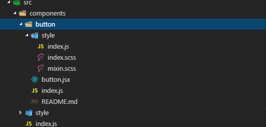
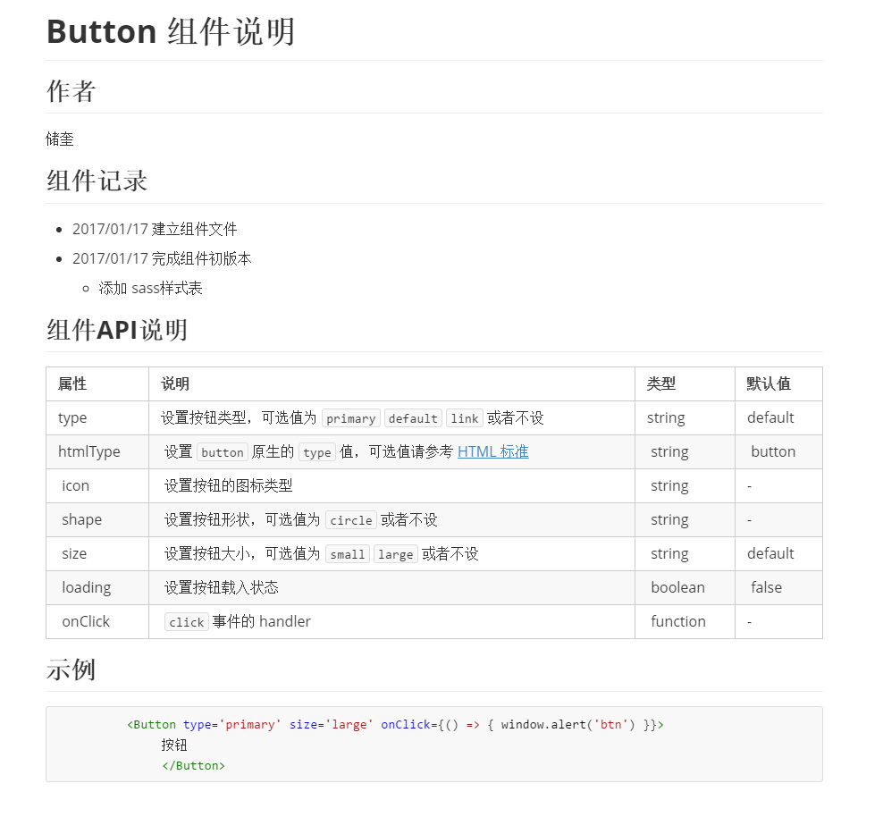

# METE DESIGN产品说明

本产品基于React开发。

## Usage

```javascript
$ git clone https://github.com/MeteDesign/MeteDesign.git
$ cd MeteDesign
$ npm install
$ npm run build
$ npm run dev
```

> 如果`npm` 被墙或者速度比较慢，可以使用淘宝镜像或者安装`cnpm`(淘宝npm)

## 技术规范

###  工具类

#### WebPack

[Webpack](https://github.com/webpack/webpack) 是当下最热门的前端资源模块化管理和打包工具。它可以将许多松散的模块按照依赖和规则打包成符合生产环境部署的前端资源。还可以将按需加载的模块进行代码分隔，等到实际需要的时候再异步加载。通过 `loader` 的转换，任何形式的资源都可以视作模块，比如 CommonJs 模块、 AMD 模块、 ES6 模块、CSS、图片、 JSON、Coffeescript、 LESS 等。

WebPack入门有一点门槛，建议初学者先看我们是如何配置的，然后再自己动手去了解相关的知识。这里我推荐两篇入门级别的文章，[Webpack-summary](https://diamont1001.github.io/webpack-summary/) 和 [入门Webpack，看这篇就够了](http://www.jianshu.com/p/42e11515c10f#)

#### JavaScript Standard Style

语法规范采用[JavaScript Standard Style](https://github.com/feross/standard) 工具来严格要求代码风格

在开发阶段不需要检测语法规范，但在build或者deploy阶段，在运行```npm run build```或者```npm run deploy```将会强行检测语法规范，当出现不符合规范时，standard脚手架将会在控制台打印输出相应的提示并且终止运行后面的编译工作。

> 如果想自动修复语法错误请运行```standard --fix```，但是像```debugger```这类调试语句将会忽略，需要手动去修复。如果想要了解更多关于standard rules，请点击[这里](http://standardjs.com/rules.html)

#### classNames

A simple javascript utility for conditionally joining classNames together.

在classNames插件中，我们可以轻松的管理业务逻辑比较复杂的css样式类，下面摘抄一句官方的话

> We take the stability and performance of this package seriously, because it is run millions of times a day in browsers all around the world. Updates are thoroughly reviewed for performance impacts before being released, and we have a comprehensive test suite.

想要了解更过关于className相关的资料，请点击[这里](https://github.com/JedWatson/classnames)

#### CSS Preprocessor · SASS

CSS 预处理器技术现在已经非常的成熟，CSS 预处理器是一种语言用来为 CSS 增加一些编程的的特性，无需考虑浏览器的兼容性问题，例如你可以在 CSS 中使用变量、简单的程序逻辑、函数等等在编程语言中的一些基本技巧，可以让你的 CSS 更见简洁，适应性更强，代码更直观等诸多好处。

> CSS allow you to do lots of things, but some features are missing to developers. What about variable, constants, and general faster syntax? As normal CSS can't do that, people created preprocessors to allow the use of variables on CSS files and then parse it to regular stylesheets.

常见的CSS预处理器有8种，分别是LESS CSS、SASS、Turbine、Switch CSS、CSS Cacheer、CSS Preprocessor、DT CSS、CSS PP。关于这8中预处理器的相关介绍可以点击[这里](http://www.catswhocode.com/blog/8-css-preprocessors-to-speed-up-development-time)， 这里我们采用SASS CSS预处理器。

关于SASS相关的语法，可以查看[阮一峰·SASS用法指南](http://www.ruanyifeng.com/blog/2012/06/sass.html)

#### Mixin

在诸如C++或者List着这样的传统语言中,织入模式就是一些提供能够被一个或者一组子类简单继承功能的类,意在重用其功能。

在Javascript中,我们会将从Mixin继承看作是通过扩展收集功能的一种途径.我们定义的每一个新的对象都有一个原型,从其中它可以继承更多的属性.原型可以从其他对象继承而来,但是更重要的是,能够为任意数量的对象定义属性.我们可以利用这一事实来促进功能重用。

Mixin支持在一个系统中降解功能的重复性,增加功能的重用性.在一些应用程序也许需要在所有的对象实体共享行为的地方,我们能够通过在一个Mixin中维护这个共享的功能,来很容易的避免任何重复,而因此专注于只实现我们系统中真正彼此不同的功能

在METE DESIGN产品中，你会看到我们在React组件（将由HOC代替）和SASS中都有Mixin的身影。

关于Mixin的学习资料，请自行查阅，相信你会有很强的自学能力:-D。

### 组件书写要求

为了能够很好的维护组件，我们迫切需要一个统一的风格来约束开发人员，下面将会详细说明这一约束。

~~类名命名~~
~~为每一个组件添加一个名为 prefixCls 的 prop，并将其默认值也设置为 xui-componentName，这样就在 jsx 层面也保证了代码的统一性，方便团队成员阅读及维护 。~~

#### CSS组件类名命名

为每一个组件添加一个名为 ```prefixCls``` 的 `prop`，并将其默认值也设置为 `md-componentName[-xxx]`，此属性将用于组件统一样式命名，在组件层面上来说，便于后期团队交接以及组件维护工作。

#### 结构规范

组件 DOM 结构自由，允许传入DOM结构
组件内部不进行数据结构处理
在设计回调数据的数据结构时，我们只使用了单一值（如 Input 组件的回调）和对象两种数据结构，尽量避免了使用传统组件库中常用的数组。相较于对象，数组其实是一种含义更为丰富的数据结构，因为它是有向的（有顺序的），比如在上面时间组的例子中，timeList 就被设计为数组，这样它就可以在承载展示数据的同时表达出时间组展示的顺序，极大地方便了组件使用。但在给使用者抛出回调数据时，并不是每一位使用者都能够像组件设计者那样清楚回调数据的顺序，使用数组其实变相增加了使用者的记忆成本，

```javascript
const value = data[0];
```

这样的表达式，因为没有人能够保证被取值的这个数组长度满足需要且当前位上的元素就是要取的值。另一方面，对象因为键值对的存在，在具体到某一个元素的表意上要比数组更为丰富。例如选择日历区间后的回调需要同时返回开始日期及结束日期：

```javascript
// array
['2016-11-11', '2016-12-12']

// object
{
   firstDay: '2016-11-11',
   lastDay: '2016-12-12',
}
```


严格来讲上述的两种表达方式没有对错之分，只是对象的数据结构更能够清晰地表达每个元素的含义并消除顺序的影响，更利于不了解组件库内部代码的使用者快速上手。

for-in里一定要有hasOwnProperty的判断；

```javascript
for (key in obj) {
  if (obj.hasOwnProperty(key)) {
    // be sure that obj[key] belongs to the object and was not inherited
    console.log(obj[key]);
  }
}
```


#### 组件分类

~~纯渲染组件和智能控件~~
~~不含有内部状态的以纯函数写法表示的无交互的纯渲染组件~~
~~含有内部状态以 ES6 class 写法表示的有交互的智能控件~~

在React中组件大致可分为状态组件和无状态组件（stateless functions）。

##### 状态组件（辅）

状态组件一般出现在容器组件、`Redux`等这样的用于控制组件之间的状态管理，它具有完整的生命周期和`state`状态机。能够很好的控制着全局表现，但是在`React`这样的强`View`，以UI层为主的框架中，似乎找不到理由不大力推崇无状态组件，即使状态组件比无状态组件要灵活的多，但是无状态组件有着它独特的优势，在产品中我们推崇以无状态组件为主，状态组件为辅。下面将简单介绍下无状态组件。

##### 无状态组件（主）

无状态组件顾名思义就是没有状态，在`React`中的表现是没有生命周期和`state`状态机，最主要是没有`this`关键字。无状态组件不是类，而是一个函数，而且是一个纯函数。对于一个确定的输入就有确定的输出。这对于逻辑上来说是非常有意义的，也非常方便测试和维护。下面摘抄一句react官方的话。

> This pattern is designed to encourage the creation of these simple components that should comprise large portions of your apps. In the future, we’ll also be able to make performance optimizations specific to these components by avoiding unnecessary checks and memory allocations.

至于无状态组件有哪些优势，请自行脑补:-D。

在产品中，我们有两条原则：

1. 如果组件需要生命周期方法，使用ES6 Classes
2. 如果你能够使用无状态函数组件，那就用吧

#### 事件函数命名

在回调方面，所有的组件内部函数都以 handleXXX（handleClick, handleHover, handleMouseover 等）为命名模板，所有对外暴露的回调函数都以 onXXX（onChange、onSelect 等）为命名模板，这样在维护一些依赖层级较深的底层组件时，就可以在 render 方法中一眼看出某个回调是在处理内部状态，还是会抛回到更高一层。

#### 公共样式~~（即为默认主题）~~

每个组件中需要的具有通用性的样式优先从公共样式中查找引用，
如果公共样式中没有则需要商议是否归到公共样式中

#### 文件目录

- [x] 每个组件都要求放到```src/components/```目录下。

- [x] 以组件名称命名，新建立一个文件夹。

- [x] 在组件文件夹下建立一个```index.js```文件，该文件作为组件暴露点。

- [x] 每个组件文件夹下都要求有一个```style```文件夹，来存放样式表文件，同样在该文件夹下要求建立一个`index.scss`文件作为暴露点。

- [x] 在组件文件夹下建立你要写的组件文件，比如```button```组件，我可以命名为```button.jsx```。

- [x] 在组件文件夹下要求建立一个```README.md```文件，内容主要记录组件的说明（作者、更新维护记录、API说明等等）。

   下面给出一张文件结构示例图:

   

   下面提供一个`README.md`的示例

   
## 开发工具推荐

- 代码编辑器

  - [Visual Studio Code](https://code.visualstudio.com/) 
  - [Sublime Text 3](https://www.sublimetext.com/3)

- MarkDown 编辑器

  - [Typora](https://typora.io/)

- 梯子

  - [ShadowSocksR](https://github.com/shadowsocksr/shadowsocksr)

- 版本控制器

  - [Source Tree](https://www.sourcetreeapp.com/)

  - [TortoiseGit](https://tortoisegit.org/)


## 参考资料

- Antd
- Ant Motion
- React-Component

*参考优秀设计思想，打造魅力产品特色。*

------

**METE DESIGN TEAM**