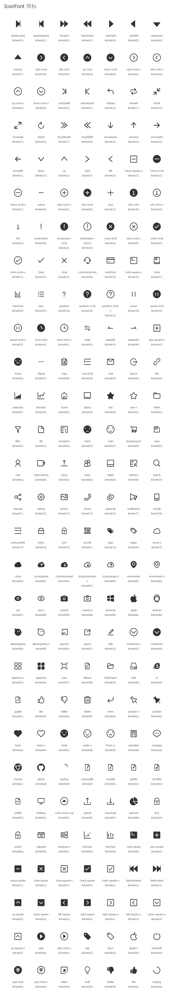

# Icon 组件说明

## 作者

储奎

## 组件记录

- 2017/01/18 创建Icon组件
- 2017/02/13 更新README.md文件，增加`可用Icon列表`

## 组件API说明

| 属性   | 说明       | 类型      | 默认值   |
| ---- | -------- | ------- | ----- |
| type | 字体图标类型   | string  | -     |
| spin | 是否启动旋转动画 | boolean | false |

## 示例

```react
{/*回退*/}   
<Icon type='stepbackward' />
{/*旋转loading*/}
<Icon type='loading' spin />
```
## 可用Icon列表

